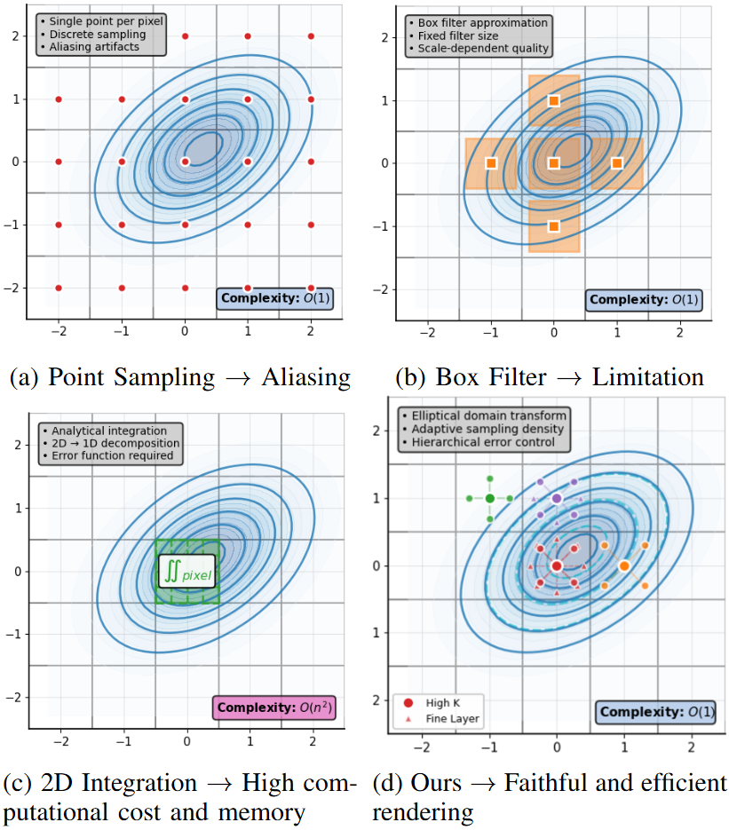

<!-- PROJECT LOGO -->

<p align="center">

  <h1 align="center"> MipSLAM: Alias-Free Gaussian Splatting SLAM
  </h1>
  <p align="center">
    <a><strong>Yingzhao Li</strong></a>
    ·
    <a><strong>Yan Li</strong></a>
    ·
    <a><strong>Shixiong Tian</strong></a>
    ·
    <a><strong>Yanjie Liu</strong></a>
    ·
    <a><strong>Lijun Zhao*</strong></a>
    ·
    <a><strong>Gim Hee Lee</strong></a>
  </p>
  <p align="center">(* Corresponding author)</p>

  <h3 align="center"> ICRA 2026</h3>

  <h3 align="center"><a href="https://arxiv.org/abs/2603.06989">Paper</a></h3>
  <div align="center"></div>

<p align="center">
This software implements the dense SLAM system presented in our paper <a href="https://arxiv.org/abs/2603.06989">MipSLAM: Alias-Free Gaussian Splatting SLAM</a> at ICRA 2026.
</p>

## Highlights

- **First frequency-aware 3DGS SLAM** supporting arbitrary camera reconfiguration (intrinsics, resolution, zoom) with high-fidelity anti-aliasing.
- **Elliptical Adaptive Anti-aliasing (EAA)**: geometry-driven numerical integration that approximates analytic accuracy at a fraction of the cost.
- **Spectral-Aware Pose Graph Optimization (SA-PGO)**: models trajectories as spatiotemporal signals and leverages graph Laplacian spectral decomposition for drift-robust pose estimation.

<p align="center">
  <a href="">
    
  </a>
</p>
<br>

# Note
- A version with higher localization accuracy and better rendering quality is coming soon.

# Getting Started
## Installation
```
git clone https://github.com/yzli1998/MipSLAM.git --recursive
cd MipSLAM
```
Setup the environment.

```
conda env create -f environment.yml
conda activate MipSLAM
```
Depending on your setup, please change the dependency version of pytorch/cudatoolkit in `environment.yml` by following [this document](https://pytorch.org/get-started/previous-versions/).

Our test setup were:
- Ubuntu 20.04: `pytorch==1.12.1 torchvision==0.13.1 torchaudio==0.12.1 cudatoolkit=11.6`
- Ubuntu 18.04: `pytorch==1.12.1 torchvision==0.13.1 torchaudio==0.12.1 cudatoolkit=11.3`

## Quick Demo
```
bash scripts/download_tum.sh
python slam.py --config configs/mono/tum/fr3_office.yaml
```
You will see a GUI window pops up.

## Downloading Datasets
Running the following scripts will automatically download datasets to the `./datasets` folder.
### TUM-RGBD dataset
```bash
bash scripts/download_tum.sh
```

### Replica dataset
```bash
bash scripts/download_replica.sh
```

### EuRoC MAV dataset
```bash
bash scripts/download_euroc.sh
```


## Run
### Monocular
```bash
python slam.py --config configs/mono/tum/fr3_office.yaml
```

### RGB-D
```bash
python slam.py --config configs/rgbd/tum/fr3_office.yaml
```

```bash
python slam.py --config configs/rgbd/replica/office0.yaml
```
Or the single process version as
```bash
python slam.py --config configs/rgbd/replica/office0_sp.yaml
```


### Stereo (experimental)
```bash
python slam.py --config configs/stereo/euroc/mh02.yaml
```

## Live demo with Realsense
First, you'll need to install `pyrealsense2`.
Inside the conda environment, run:
```bash
pip install pyrealsense2
```
Connect the realsense camera to the PC on a **USB-3** port and then run:
```bash
python slam.py --config configs/live/realsense.yaml
```
We tested the method with [Intel Realsense d455](https://www.mouser.co.uk/new/intel/intel-realsense-depth-camera-d455/). We recommend using a similar global shutter camera for robust camera tracking. Please avoid aggressive camera motion, especially before the initial BA is performed.

# Evaluation
To evaluate our method, please add `--eval` to the command line argument:
```bash
python slam.py --config configs/mono/tum/fr3_office.yaml --eval
```
This flag will automatically run our system in a headless mode, and log the results including the rendering metrics.

# Reproducibility
There might be minor differences between the released version and the results in the paper. Please bear in mind that multi-process performance has some randomness due to GPU utilisation.
We run all our experiments on an RTX 4090, and the performance may differ when running with a different GPU.

# Acknowledgement
This work incorporates many open-source codes. We extend our gratitude to the authors of the software.
- [3D Gaussian Splatting](https://github.com/graphdeco-inria/gaussian-splatting)
- [MonoGS](https://github.com/muskie82/MonoGS)
- [Mip-Splatting](https://github.com/autonomousvision/mip-splatting)

# Citation
If you found this code/work to be useful in your own research, please consider citing the following:

```bibtex
@inproceedings{Li:Li:etal:ICRA2026,
  title={{M}ip{SLAM}: {A}lias-{F}ree {G}aussian {S}platting {SLAM}},
  author={Yingzhao Li and Yan Li and Shixiong Tian and Yanjie Liu and Lijun Zhao and Gim Hee Lee},
  booktitle={Proceedings of the IEEE International Conference on Robotics and Automation (ICRA)},
  year={2026}
}
```